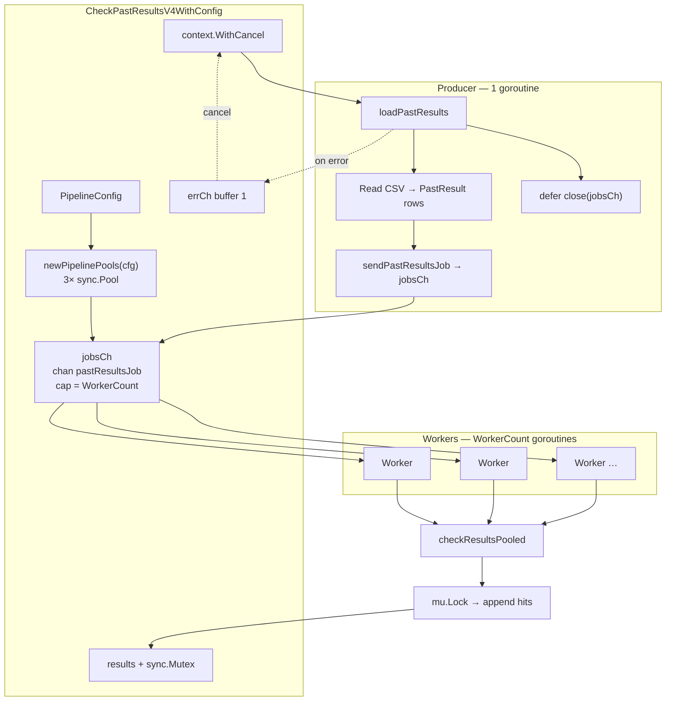
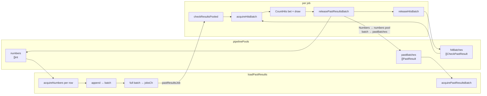
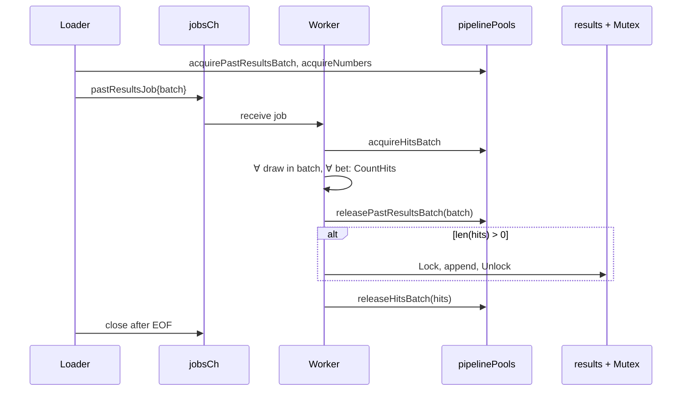
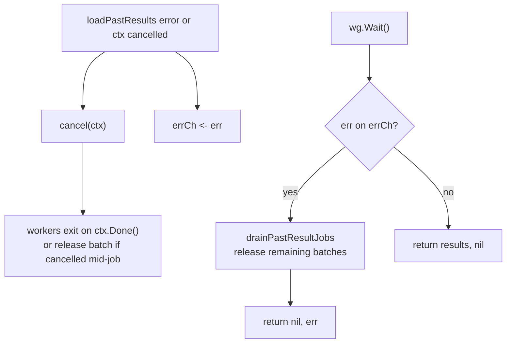

# Past-results check pipeline (V4)

`CheckPastResultsV4WithConfig` in `internal/result` checks every configured bet against historical draws loaded from a CSV file. It uses a **producer–consumer** design: one goroutine streams batched past results into a bounded channel; a fixed pool of workers compares each batch against all bets and merges hits into a shared slice.

Entry points:

- `CheckPastResultsV4` — wraps `CheckPastResultsV4WithConfig` with default `PipelineConfig` and `results.csv`
- `CheckPastResultsV4WithConfig` — tunable batch size, worker count, and paths

Configuration (`PipelineConfig`, see `internal/result/pipeline.go`):

| Field | Default | Role |
|-------|---------|------|
| `BatchSize` | 256 | Past draws per job |
| `WorkerCount` | `runtime.GOMAXPROCS(0)` | Parallel workers |
| `ResultsPath` | `results.csv` | CSV input |
| `ResultSize` | `model.RaffleSize` | Initial cap for `[]PastResult` pool slices |
| `HitSize` | 8 | Initial cap for `[]CheckPastResult` pool slices |

## High-level flow



## Parallel processing

| Role | Count | Responsibility |
|------|--------|----------------|
| Loader | 1 | Streams CSV, fills batches of `BatchSize`, enqueues `pastResultsJob` |
| Workers | `WorkerCount` | Per job: compare batch × all bets, merge hits under mutex |
| Channel | `jobsCh` cap = `WorkerCount` | Backpressure when workers are busy |

Workers exit when `jobsCh` is closed and drained, or when `ctx` is cancelled (loader error or shutdown).

## Pool architecture

Three `sync.Pool` instances on `pipelinePools` reuse slices and cut allocations during CSV load and per-job checking.



**Lifecycle**

1. **Loader** — `acquirePastResultsBatch` builds a batch; each CSV row uses `acquireNumbers` for the 15 draw numbers. When `len(batch) == BatchSize`, the batch is sent as a job and a fresh batch is acquired.
2. **Worker** — `acquireHitsBatch` collects matches; `releasePastResultsBatch` returns number slices to `numbers` and clears the batch back to `pastBatches`; `releaseHitsBatch` clears the hits slice back to `hitBatches` (via `defer` after merge).
3. **Copy on hit** — matching rows copy `PastResult.Numbers` so pooled slices are not aliased after release.

## Per-job sequence



## Error and cancellation



If the loader fails, `drainPastResultJobs` consumes any jobs still on `jobsCh` and calls `releasePastResultsBatch` so pooled memory is not leaked.

## Data plane (one job)

```
CSV row → acquireNumbers() → PastResult.Numbers
                ↓
     batch[0 .. BatchSize-1] → jobsCh → Worker
                ↓
  ∀ pastResult ∈ batch, ∀ bet ∈ bets:
       hits = CountHits(bet, pastResult)
       if hits >= minHits → append to hits slice (copy Numbers)
                ↓
       merge into shared results (mutex)
```

## Source map

| Concern | File |
|---------|------|
| Orchestration, workers, `checkResultsPooled` | `internal/result/results_parallel.go` |
| Pools, CSV loader, `PipelineConfig` | `internal/result/pipeline.go` |
| Hit counting | `internal/checker` |

Benchmarks: `BenchmarkCheckPastResultsV4WithConfig_*` in `internal/result/results_bench_test.go`.
